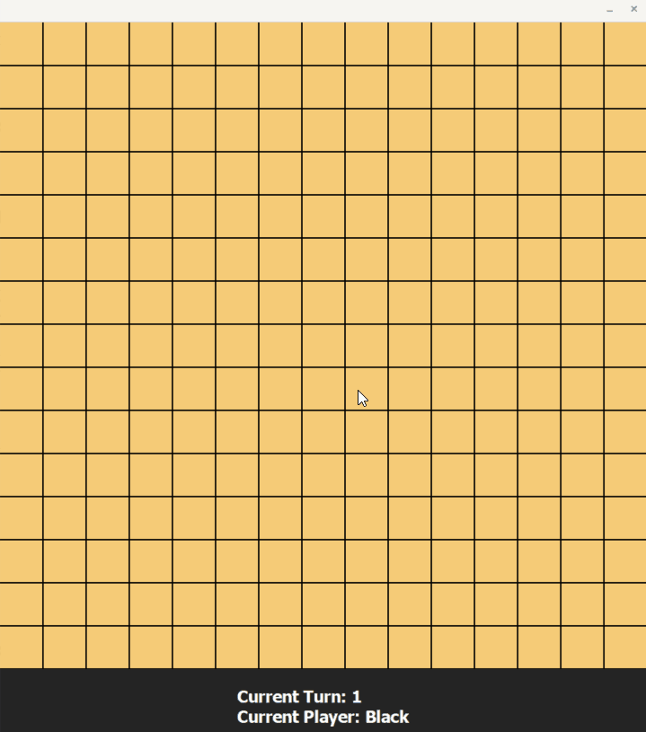

# FiveInARow.jl
* Introduction
    
    Five in a row game with GUI, written in Julia with Gtk.jl and Graphics.jl. 
    <p align="center">
    
    </p>

* Reference

    Most of the codes are arranged from the repository [GUIAppExample.jl](https://github.com/goropikari/GUIAppExample.jl/tree/master/example/Reversi).

    These examples are very useful to learn Julia with GUI.

    Many thanks to [goropikari](https://github.com/goropikari).

* How to play
  
    * Use this package and just ```GtkStartGame()```.
    * Run the script ```Test.jl```.

* To do list

    1. Add a Blink.jl version.
